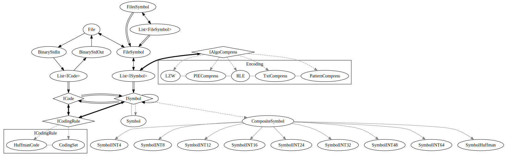

### 
here you will see a the compression class.
the concept is simple, a file is a list of code, a code can be translate into a symbol. we play with symbol to do compression.

so a standard file is a list of code between 0 and 255, it corresponding symbol have id between 0 and 255. we add some symbol to do compression.
example we replace symbols CR and FL by CRFL, we replace symbole sequence :"AAAAAAAAAAAA" by RLE+INT4(12)+A, at the end when we come back to a file instead of 256 symbol we have more like 277, so we change the code to store it.
we can use huffman coding or something else.
see the graph of relation between class :

